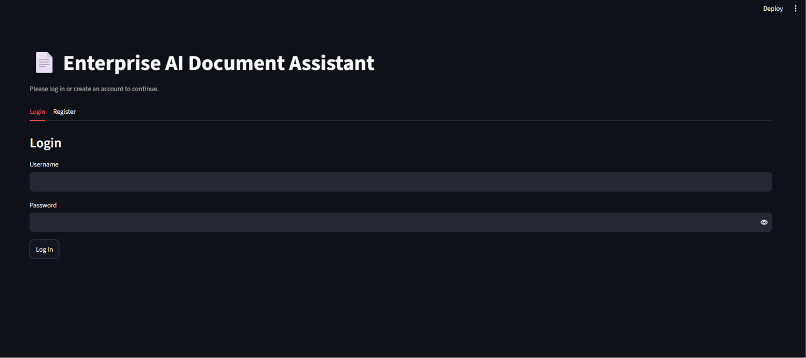
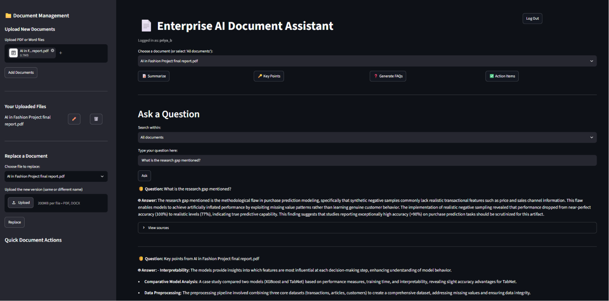
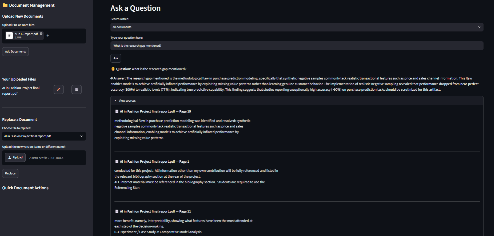

# Enterprise AI Document Assistant

An AI-powered document assistant that lets users upload PDF and Word files, search them semantically, and ask questions in natural language. The system uses a Retrieval-Augmented Generation (RAG) workflow to ground answers in the user's own documents rather than relying on general knowledge alone.

This project demonstrates practical experience with:
- Large Language Models (LLMs)
- Vector databases and embeddings
- Document processing and chunking
- Building a full end-to-end AI application with a user interface
- Real-world AI workflow design for enterprise-style document search

## Screenshots






## Project Overview

The Enterprise AI Document Assistant provides a secure, user-friendly interface where each user can:
- Create an account and log in securely
- Upload PDF and Word documents
- Build a personal vector database from their uploaded files
- Ask questions about the content of those documents
- Get grounded answers with source-based context
- Generate summaries, key points, FAQs, and action items from documents

This makes the application useful for scenarios such as:
- Internal company knowledge bases
- Policy and compliance documents
- Research papers and technical reports
- Contract and meeting document review

## Key Features

- Secure login and registration system with strong password requirements
- Per-user document storage and isolated vector databases
- Support for PDF and DOCX uploads
- Automatic document loading and text extraction
- Intelligent chunking for better retrieval quality
- Semantic search using embeddings and vector similarity (MMR for diverse results)
- AI-generated answers grounded in retrieved document context
- Conversation memory for natural follow-up questions
- Metadata filtering to search within a specific document
- Quick document actions: summarization, key-point extraction, FAQ generation, action item extraction
- Document management features including rename, delete, and replace
- Persistent chat history saved per user

## Tech Stack

- Python
- Streamlit for the web interface
- LangChain for orchestration
- Chroma for vector storage
- Hugging Face (BAAI/bge-small-en-v1.5) for free, local embeddings
- OpenAI GPT models for answer generation
- PyPDF and python-docx for document parsing
- bcrypt for password hashing

## How It Works

1. A user registers and logs into their own private account.
2. The user uploads one or more PDF or Word documents.
3. The documents are loaded and split into smaller text chunks.
4. Each chunk is converted into embeddings and stored in a vector database scoped to that user.
5. When the user asks a question, the system retrieves the most relevant chunks using MMR-based semantic search.
6. The LLM uses those retrieved chunks — plus recent conversation history — to generate a grounded, source-cited answer.

This is a classic RAG (Retrieval-Augmented Generation) architecture, which is highly relevant in modern AI application development.

## Project Structure

```
enterprise-ai-document-assistant/
├── app.py                  — Streamlit web application
├── requirements.txt
├── src/                     — Core AI and document processing modules
│   ├── chatbot.py           — question answering and document analysis
│   ├── document_loader.py   — document parsing
│   ├── embeddings.py        — embedding model setup
│   ├── llm.py                — language model setup
│   ├── retriever.py          — retrieval logic
│   ├── text_splitter.py     — chunking logic
│   └── vector_store.py      — Chroma vector store management
├── utils/                   — authentication and helper functions
├── tests/                   — evaluation scripts for retrieval and chunking performance
├── data/                    — user documents and vector databases (not committed to git)
└── screenshots/             — app screenshots for documentation
```

## Installation

### Prerequisites

- Python 3.9 or later
- An OpenAI API key (used for answer generation only; embeddings run locally for free)

### Setup

1. Clone the repository:
   ```bash
   git clone https://github.com/priya-bellamkonda/enterprise-ai-document-assistant.git
   cd enterprise-ai-document-assistant
   ```

2. Create and activate a virtual environment:
   ```bash
   python -m venv venv
   venv\Scripts\activate
   ```

3. Install the required dependencies:
   ```bash
   pip install -r requirements.txt
   ```

4. Create a `.env` file in the project root and add your API key:
   ```env
   OPENAI_API_KEY=your_openai_api_key_here
   ```

## Run the Application

Start the app with:

```bash
streamlit run app.py
```

Then open the local Streamlit URL in your browser.

## Example Usage

- Register a new account
- Upload a contract, policy document, or technical report
- Ask questions such as:
  - "What are the key points of this document?"
  - "Summarize the main findings."
  - "What action items are listed here?"
- Ask a follow-up question like "What about the second point?" and the assistant will understand the context from the previous answer.

## Evaluation and Testing

To validate design decisions in the RAG pipeline, the system was benchmarked on chunk sizes and embedding models using a real uploaded document (5 pages). The full evaluation script is available in `tests/evaluation.py` and can be re-run against any document set.

### Chunk Size Comparison

| Chunk Size | Chunks Generated | Split Time |
|-----------|------------------|------------|
| 500 chars  | 35 chunks        | 0.001s     |
| 1000 chars | 15 chunks        | 0.001s     |
| 1500 chars | 10 chunks        | 0.001s     |

**Finding:** Smaller chunk sizes produce more granular, precise search results but risk splitting related context across multiple chunks. Larger chunks preserve more context per chunk but reduce retrieval precision. **1000 characters was chosen as the default** — it balances context preservation with retrieval accuracy, and matches common industry practice for RAG systems.

### Embedding Model Comparison

| Model                     | Embedding Time | Avg Query Time |
|--------------------------|---------------|-----------------|
| text-embedding-3-small    | 1.357s        | 0.147s          |
| text-embedding-3-large    | 0.574s        | 0.183s          |

**Finding:** After initial testing with OpenAI embeddings, the project was migrated to a free, local Hugging Face embedding model (`BAAI/bge-small-en-v1.5`) to remove API cost and rate-limit dependency for the embedding step entirely, while keeping retrieval quality strong for document Q&A use cases.

## Why This Project Matters

This project showcases skills in:
- AI application development
- Prompt engineering and LLM integration
- Semantic search and retrieval systems
- Building user-focused AI experiences
- End-to-end project design from data ingestion to user interaction
- Authentication, data isolation, and basic security practices (password hashing)
- Data-driven evaluation of system design choices
- Practical cost-awareness in AI system design (choosing free local embeddings over paid API calls)

It is a practical example of how modern AI systems can be built for real business and knowledge-management use cases.


### Advantages
- Provides fast, natural-language access to document content
- Uses retrieval-augmented generation to improve answer accuracy
- Supports multiple users with fully isolated document storage and databases
- Demonstrates a complete AI workflow from ingestion to interaction
- Includes real evaluation data comparing chunking and embedding strategies
- Uses free, local embeddings — no cost or rate limits for the retrieval step
- Useful for real-world knowledge management and document analysis tasks

### Disadvantages
- Performance depends heavily on the quality of document chunking and retrieval
- Answers can still be affected by incomplete or noisy document content
- Answer generation still requires an OpenAI API key and internet access
- Large document sets may increase processing time and storage usage
- Cannot read scanned documents or images embedded in files (no OCR support) — only extracts real, selectable text
- Designed for local, single-machine use; would need additional work (admin controls, larger-scale storage) to support many simultaneous users

## Future Enhancements

Possible improvements for the next version include:
- Fully free answer generation using a local or open-source LLM
- OCR support for scanned PDFs
- Better document ranking and relevance tuning
- Export of chat history and summaries as PDF/Markdown
- Admin dashboard for managing users and documents
- Support for larger-scale, multi-server data storage

## License

This project is for educational and portfolio purposes.